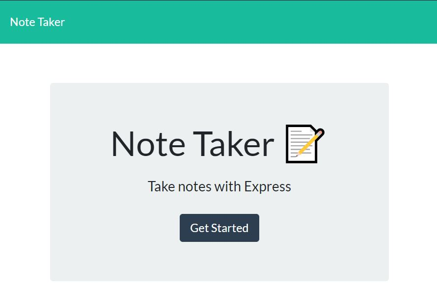
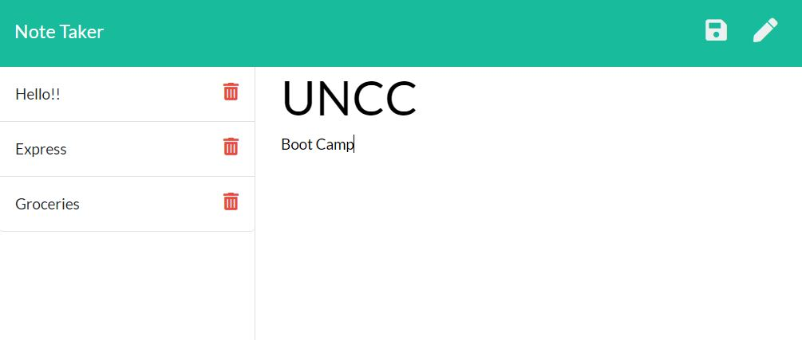

# Unit 11 Express Homework: Note Taker

## Description
 Note taking application designed to write, save, and delete notes, written to and retrieved from a back end JSON file.

## Table of Content

- [Muck-Up](#Muck-up)
- [Questions](#questions)

## You can click [here](https://github.com/Lauracejas) for deployed application

---

;

## Github Repo
[Note-taker](https://github.com/Lauracejas/Note-Taker)

